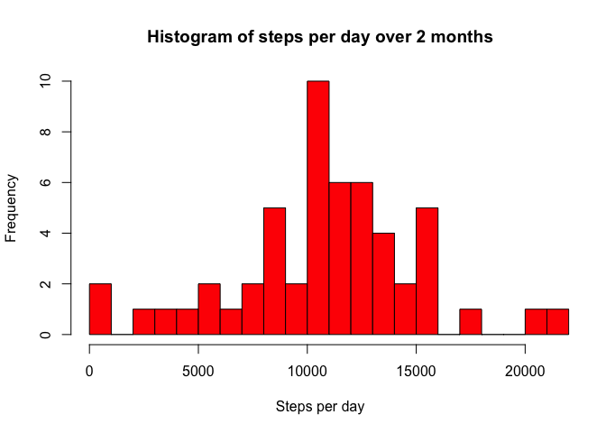
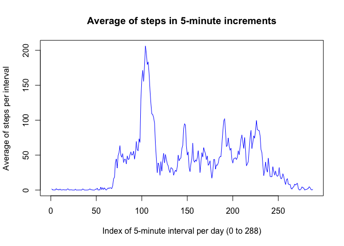
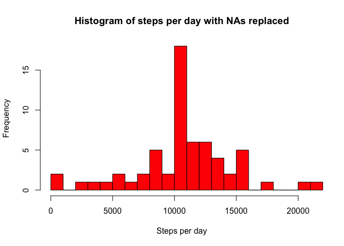
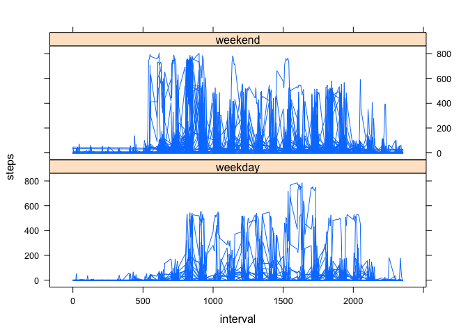

# Reproducible Research: Peer Assessment 1


## Loading and preprocessing the data

The file "RepData_PeerAssessment1/activity.zip" has been downloaded from the [site](https://github.com/rdpeng/RepData_PeerAssessment1). The file was unzipped and put on the author's GitHub account.  It is read into R as a dataframe, "activity." 


```r
library(RCurl)
```

```
## Loading required package: bitops
```

```r
temp<-getURL("https://raw.githubusercontent.com/lrothschild/RepData_PeerAssessment1/master/activity.csv")
activity<-read.csv(text=temp)
activity$date<-as.Date(activity$date)
```

## What is mean total number of steps taken per day?
It will be convenient to create a new dataframe, "daily," to sum the steps taken each day. Here is a histogram of total steps per day (over 53 consecutive days)


```r
daily<-aggregate(steps ~ date, activity, sum, na.rm=TRUE)
hist(daily$steps,xlim=c(0,21194),breaks=20,xlab="Steps per day",
     main="Histogram of steps per day over 2 months",col="red")
```

 

The mean and median are calculated directly from the vector daily$steps.

Mean= 10766

Median= 10765

## What is the average daily activity pattern?

To answer this question, a new dataframe, "actvty_by_time," is obtained from activity by taking the mean (over 53 days) for each 5-minute interval. 


```r
actvty_by_time<-aggregate(steps~interval,activity,mean)
plot(actvty_by_time$steps,type="l",xlim=c(0,288),ylim=c(0,206),
     xlab="Index of 5-minute interval per day (0 to 288)",
     ylab="Average of steps per interval",col="blue",main="Average of steps in 5-minute increments")
```

 

The 5-minute interval with the maximum number of steps can be calulated directly from the data base actvty_by_time.


```r
best_interval<-which(actvty_by_time$steps==max(actvty_by_time$steps))
minutes_of_interval<-best_interval*5
hour_of_interval<-floor(minutes_of_interval/60)
min_past_hour<-(minutes_of_interval)-hour_of_interval*60
```

The 5-minute interval of maximum steps is 520, which begins at 8:40.

## Imputing missing values

The missing values for steps in each 5-minute intervals will be replaced by the mean, over all days,  of the steps in that interval for which the data is available. The resulting database is "act2". 


```r
newSteps<-rep(actvty_by_time$steps,17568/288)
act2<-activity
act2$steps[is.na(activity$steps)]<-newSteps[is.na(activity$steps)]
```
Here is a histogram of total steps per day (over 53 consecutive day
s) with NA's replaced.


```r
par(mfrow = c(1, 1))
daily2<-aggregate(steps ~ date, act2, sum)
hist(daily2$steps,xlim=c(0,21194),breaks=20,xlab="Steps per day",
     main="Histogram of steps per day with NAs replaced",col="red")
```

 

The mean and median over steps per day are calculated as before. The mean is exactly the same as before replacing missing values since for each day either all or none of the values is missing (and the missing ones are replaced by the mean).  The median occurs on one of the days where the missing values have been inserted, so it is slightly different from the previous median.

Mean after replacing missing values: 10766

Median after replacing missing values: 10766


## Are there differences in activity patterns between weekdays and weekends?

  On weekends the number of steps throughout the day is generally higher.  Also, the steps are more evenly distributed through the day, as shown by the following graph.  To construct the graphs, a column dividing the days into two classes, weekend and weekday, is added to act2.


```r
type_of_day<-function(x){ifelse(weekdays(x) %in% c("Saturday","Sunday"),"weekday","weekend")}
act3<-act2
act3$type_Day<-type_of_day(act2$date)
act3$type_Day<-as.factor(act3$type_Day)
```

The graphs are drawn from act3 using lattice.


```r
library(lattice)
xyplot(steps~interval|type_Day,data=act3,type="l",layout=c(1,2))
```

 
